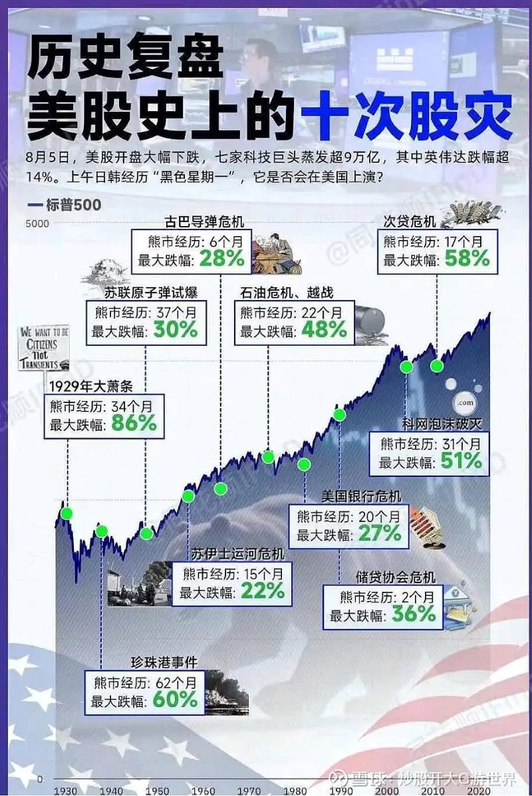

# 金融理财
> 一个人的投资理念和方式是由其价值观决定的。

## 资产分类
| 投资类型 | 投资标的 | 具体标的 | 风险 | 年化收益率 | 年化收益率范围 | 购买时机 | 卖出时机 |
| - | - | - | - | - | - | - | - |
| 股票 | 股票 | 苹果、亚马逊、谷歌等 | 高 | 高 | 7% - 10%+ | 市场低迷或估值合理 | 达到目标价或市场泡沫 |
| 指数基金 | 特定市场指数 | 纳斯达克100、S&P 500 | 中 | 中到高 | 6% - 9% | 市场低迷或长期投资计划 | 达到长期目标或市场泡沫 |
| REITs | 房地产资产 | 公寓、写字楼、购物中心等 | 中到高 | 中到高 | 5% - 8% | 房地产市场低迷或利率低 | 房地产市场过热或利率上升 |
| 贵金属 | 实物贵金属及其相关金融产品 | 黄金、白银、贵金属ETF | 中 | 中 | 3% - 6% | 通胀预期上升或市场不确定 | 通胀稳定或市场稳定 |
| 债券基金 | 债券及其他固定收益证券 | 政府债券、公司债券 | 中 | 中 | 3% - 5% | 利率高点或经济不确定 | 利率下降或债券到期前 |
| 货币基金 | 短期高流动性的货币市场工具 | 国库券、商业票据、银行定期存单和回购协议 | 低 | 低 | 1% - 3% | 资金安全 | / |
| 存款 | 银行存款 | / | 极低 | 极低 | 0.5% - 2% | 资金安全 | / |

## 经济规律
| 货币政策 | 措施 | 货币 |
| - | - | - |
| 紧缩 | 提高利率、减少货币供应 | 升值 |
| 宽松 | 降低利率、增加货币供应 | 贬值 |

* 利率引发的变化

| 利率 | 货币 | 债券 | 股票 |
| - | - | - | - |
| 上升 | 升值 | 下跌 | 下跌 |
| 降低 | 贬值 | 上涨 | 上涨 |

## 股市规律
> 进入下跌周期原因：**经济衰退，利率上升，股市泡沫(如纳指100的PE到40)，重大事件(新冠病毒/大型战争)**

## 美股史上的股灾
