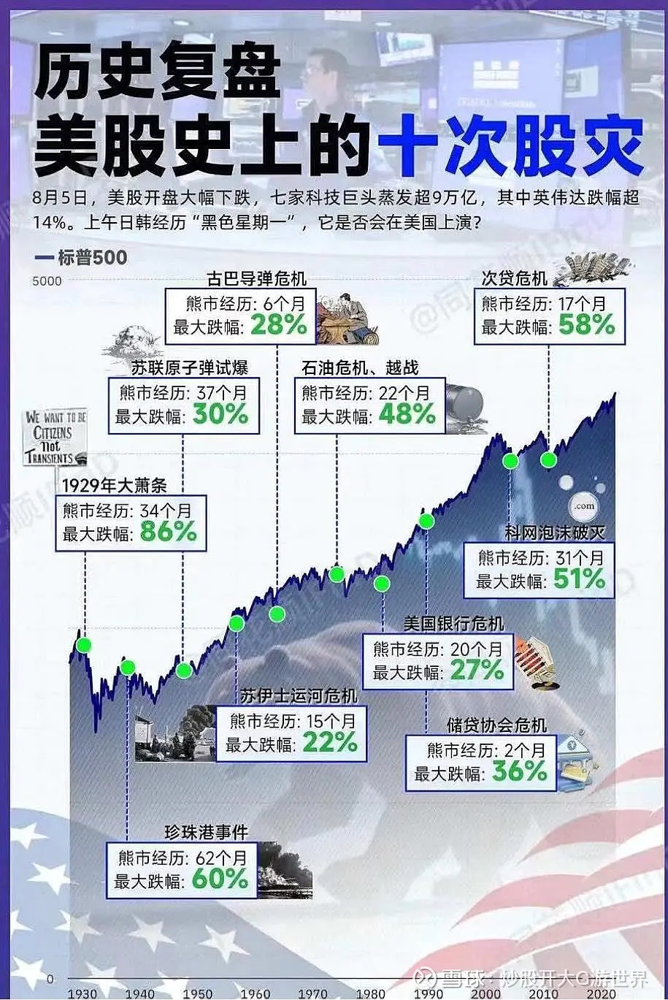

# 金融理财
## 资产分类
| 投资类型 | 投资标的 | 具体标的 | 风险 | 年化收益率 | 年化收益率范围 | 购买时机 | 卖出时机 |
| - | - | - | - | - | - | - | - |
| 股票 | 股票 | 苹果、亚马逊、谷歌等 | 高 | 高 | 7% - 10%+ | 市场低迷或估值合理 | 达到目标价或市场泡沫 |
| 指数基金 | 特定市场指数 | 纳斯达克100、S&P 500 | 中 | 中到高 | 6% - 9% | 市场低迷或长期投资计划 | 达到长期目标或市场泡沫 |
| REITs | 房地产资产 | 公寓、写字楼、购物中心等 | 中到高 | 中到高 | 5% - 8% | 房地产市场低迷或利率低 | 房地产市场过热或利率上升 |
| 贵金属 | 实物贵金属及其相关金融产品 | 黄金、白银、贵金属ETF | 中 | 中 | 3% - 6% | 通胀预期上升或市场不确定 | 通胀稳定或市场稳定 |
| 债券基金 | 债券及其他固定收益证券 | 政府债券、公司债券 | 中 | 中 | 3% - 5% | 利率高点或经济不确定 | 利率下降或债券到期前 |
| 货币基金 | 短期高流动性的货币市场工具 | 国库券、商业票据、银行定期存单和回购协议 | 低 | 低 | 1% - 3% | 资金安全 | / |
| 存款 | 银行存款 | / | 极低 | 极低 | 0.5% - 2% | 资金安全 | / |

## 经济规律
| 货币政策 | 措施 | 货币 |
| - | - | - |
| 紧缩 | 提高利率、减少货币供应 | 升值 |
| 宽松 | 降低利率、增加货币供应 | 贬值 |

* 利率引发的变化

| 利率 | 货币 | 债券 | 股票 |
| - | - | - | - |
| 上升 | 升值 | 下跌 | 下跌 |
| 降低 | 贬值 | 上涨 | 上涨 |

## 投资方法论
1. 做自己懂的
1. 频繁尝试预测市场可能导致情绪化投资决策，增加风险。
1. 长期投资
    1. 价值投资：低估的
    1. 成长投资：高增长的
1. 定期回顾和调整：虽然强调长期投资，但也需要定期回顾和调整投资策略。每隔一段时间（如半年或一年）对投资组合进行一次评估，确保其仍然符合你的投资目标和风险承受能力。

### 巴菲特
* 三类资产，大致各1/3。通过衍生品对冲风险

| 分类 | 风险 | 实例 |
| - | - | - |
| 现金，现金等价物(短期国债和高流动性的货币市场工具) | 低 | 债券和固定收益投资(各种债券和固定收益证券) |
| 全资子公司 | 中 | 涉及行业包括保险、铁路、能源、制造、零售等。例如，GEICO（汽车保险公司）、BNSF（铁路运输公司）、伯克希尔·哈撒韦能源公司等。产生可观的利润和现金流，支持伯克希尔·哈撒韦的其他投资和运营需求。 |
| 股票 | 高 | 可口可乐 |

### 操作方法
* 正常时：资金只用于定投。
* 波动大时：资金分成2块，分别是定投和低位加码。预留流动资金在市场低位时能够大量买入(如回撤10%)

### 美股历史股灾
