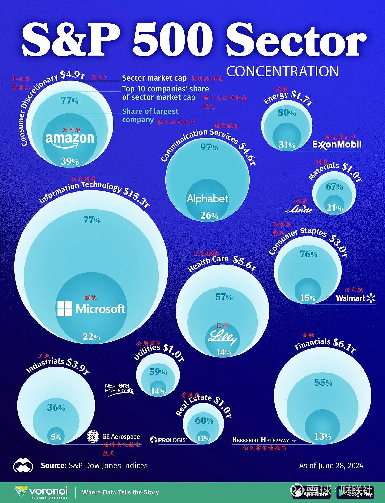

# 基金
## 指数基金
> 指数变化是先行指标：经济、政策、国际环境、利率
行业分类：工业，科技，消费，医疗，金融，能源

| 项 | 国家 | 构成 | 反映 |
| - | - | - | - |
| 上证50指数基金 | 中国 | 上交所市值最大、流动性最好的50只股票 | 中国大型企业 |
| 沪深300指数基金 | 中国 | 上交所和深交所中市值最大的300只股票 | 中国大型企业 |
| 纳斯达克100 | 美国 | 100家市值最大的非金融公司，主要是科技公司 | 全球科技 |
| 标普500 | 美国 | 美国市值最大的500家公司 | 美国大型企业 |
| 道琼斯工业 | 美国 | 美国30家大型工业公司 | 美国大型工业企业 |
| 日经225指数基金 | 日本 | 东京证券交易所中市值最大、流动性最好的225只股票 | 日本大型企业 |
| DAX(德意志股票指数) | 德国 | 法兰克福证券交易所交易的德国蓝筹股公司的30只股票 | 涵盖汽车、化工、金融、工业等 |
| 富时100(FTSE 100) | 英国 | 伦敦证券交易所中市值最大的100只股票 | 涵盖金融、能源、消费品、医疗、工业等，如汇丰银行（HSBC）、壳牌（Shell）、联合利华（Unilever）、葛兰素史克（GlaxoSmithKline）等。 |
| MSCI全球指数 | 全球 | 摩根士丹利资本国际公司（MSCI Inc.）编制的一个广泛的股票市场指数 | 反映23个发达市场国家股票市场的整体表现，广泛代表全球发达市场的股票表现 |

* 指数基金、发起式基金和联接基金。前两者都是股票基金。
* 联接基金相对股票基金的波动(收益和亏损)是10%左右。如股票基金年化是11%，则联接基金年化是9.9%。

## 购买费用
* [基金费率](https://zhuanlan.zhihu.com/p/97207789)。考虑申购费和赎回费。长期投资买A份额，否则买C份额(没有申购费，持有满30天以后不收赎回费，按日收取销售服务费)
* QDII购买时间 ：T+2(北京时间) : 周一15点前申购QDII，周三上午确认，其中包含了周一晚和周二晚的美股变化。

| 收取 | 项 | 说明 |
| - | - | - |
| 买基金 | 申购费 | 千分1.5 |
| 卖基金 | 赎回费 | 和持有时间有关 |
| 运营费用（基金运行中向基金资产收的费用） | 管理费、托管费、交易费 |  |

## 资料
* QDII基金：美元份额有现钞和现汇之分
* [指数基金，LOF、ETF、ETF联接](https://www.zhihu.com/question/283131851)
* ETF/交易型开放式指数基金（Exchange Traded Fund）:在证券交易所上市交易的开放式基金
* 反向ETF（Inverse ETF）：旨在与基准指数的表现相反，通常用于在市场下跌时获利

## 基金资料
* [纳斯达克指数](https://www.nasdaq.com/)
* 标普500指数
