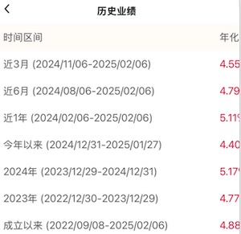

# 国内的低风险资产
## 适合的资产
### 类型
* 表格按照收益率从低到高排序

| 项 | 产品 | 风险 |
| - | - | - |
| 固收-定期存款 |  | 极低 |
| 固收-债券 | 政府债券、公司债券、地方政府债券等 | 较低 |
| 货币基金 | 短期货币市场工具。如国债、银行定期存单、商业票据等 | 低 |
| 指数基金-宽基 | https://xueqiu.com/3951090421/285607106 | 中 |
| 指数基金-行业 |  | 中高 |

* 固收(固定收益)：在预定的时间内提供固定的利息收益。
* 债券基金(不是债券)要在降息周期买，2024年收益非常好是因为利率降了很多。
* 黄金的波动大，风险是中

### 债券
| 分类 | 名称 | 股票代码 |
| - | - | - |
| 中国-国债 | 30年 | 511090 |
| 中国-国债 | 10年 | 511260 |
| 中国-国债 | 5年 | 511010 |
| 中国-国开债 | 1-5年 | 159649 |
| 美国-国债 | 20年 | TLT |

### 黄金
| 分类 | 名称 | 股票代码 |
| - | - | - |
| A股 | 黄金ETF华夏 | 518850 |
| 美股 | 黄金ETF-SPDR | GLD |

### 指数基金-宽基
| 名称 | 股票代码 |
| - | - |
| 沪深300 | 510300 |
| A500 | 512050 |

### 国内指数基金-行业
| 分类 | 名称 | 股票代码 |
| - | - | - |
| 中国-科技 | 恒生科技 | 513010 |
| 中国-科技-中概 | 中概互联 | 159605 |
| 中国-科技-创新 | 科创50 | 588000 |
| 中国-科技-机器人 | 机器人硬件 | 159530， 159559 |
| 中国-科技-芯片 | 芯片 | 159995 |
| 中国-医疗 | 医疗 | 512170 |
| 世界-医疗 | 广发全球医疗 | 场外基金 |
| 世界-科技 | 纳斯达克100 | 159501, 159659 |
| 美国-经济 | 标普500 | 513650, 513500 |

### 外币存款
* 购买时机：人民币处于贬值周期，外币利率高
* 资产如“[美元]中银理财-美元乐享天天益型)-汇(LXTTZYUSDO1A)”(中国银行APP可购买)。

## 新手学习流程
> “小额试错、持续学习、实践复盘”，不要急于求成，每一步扎实掌握后再推进。建立“风险与收益匹配”的认知，而非追求短期盈利。

| 步骤 | 操作 | 目标 | 内容 |
| - | - | - | - |
| 1 | 场外买基金 | 建立投资和风险认知 | 资产基础知识和买卖 |
| 2 | 场内(A股或美股)买宽基 | 完成风险等级自评 | 场内买卖，场内资产知识，了解高风险 |
| 3 | 实践 | 建立适合自己的投资体系，具备理性的投资心态 | 风险可控范围内实践 |

## 操作知识
1. 中高风险资产(如基金股票)，只做自己熟悉的(我是科技和医疗器械)。
1. **A股股票**和**港股基金股票**手续费用高，只买**A股基金**和**很看好的港股股票**
1. 基金选择方法：重仓股票好 + 基金规模10亿以上 + 交易费用低。指数基金买股票类的，不买链接类的。
1. 基金交易
    1. 买场内的【基于自身场内交易成本决策】。场内成本很低(手续费是十万分之5，可以忽略不计)且交易便利(买卖T+0或T+1)，场外交易不便利(至少是T+3)。
    1. 国外资产的基金需关注溢价率。

### 基金交易
* 渠道
    * 场内(证券开户，同买股票，如华泰证券)
    * 场外(如微众银行、腾讯理财通、支付宝)
* 费用：场内场外都有运营费用
    * 场内：有交易的买卖手续费，有溢价
    * 场外：有申购费和赎回费。长期买A类(一般是一年以上)，短期买C类。