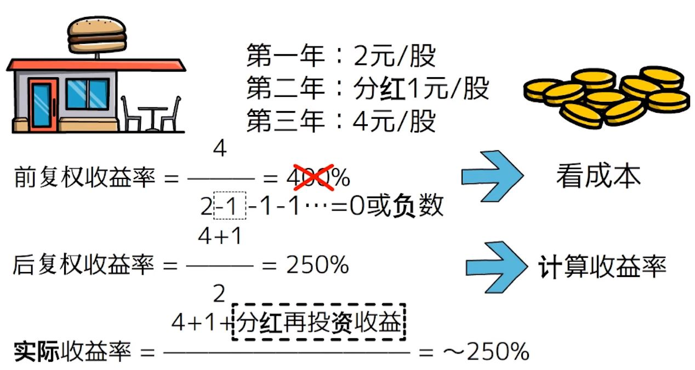

# 知识
## 术语
### 公司财务
| 项 | 全称 | 公式 | 反映 | 均值 | 大于均值 | 小于均值 |
| - | - | - | - | - | - | - |
| PE | Price to Earnings，市盈率 | 市值 / 净利润 OR 股价 / 每股收益 | 投资者对公司未来盈利能力的预期 | 15-20 | 投资者预期公司未来盈利增长较高 | 投资者预期公司未来盈利增长较低 |
| EPS | Earnings Per Share，每股收益 | 净利润 / 总股数 | 公司每股股票所获得的净利润，是衡量公司盈利能力的重要指标 | 不同行业不同 | 公司盈利能力较强 | 公司盈利能力较弱 |
| PB | Price to Book，市净率 | 股价 / 每股净资产 | 公司市场价值与其账面价值的比率，市场对公司资产价值的评价 | 1-3 | 公司资产价值较高 | 公司资产价值较低 |
| ROE | Return on Equity，股本回报率 | 净利润 / 股东权益 | 利用股东权益创造利润的能力，衡量公司的盈利能力 | 10%-15% | 公司利用股东权益创造利润的能力较强 | 公司利用股东权益创造利润的能力较弱 |
| FPE | Forward P/E Ratio，前向/动态市盈率 | 股价 / 预期每股收益 | 预期每股收益是分析师对公司未来12个月的收益预测 |  |  |  |

### 数据
| 项 | 公式 | 反映 | 有效性 |
| - | - | - | - |
| 分位点 | 指数点位所处的历史分位点。危险值80%，机会值20% | 长期趋势 | 长期 |
| 资金净流入 |  | 负数 : 资金流出 | 短期 |
| 量比 | 交易量趋势。当前成交量 / 过去N天的平均成交量 | 量比 < 1：当前成交量低于过去N天的平均成交量，交易活跃度变差 | 短期 |
| 内/外盘 | 内盘(主动买盘): 以卖方报价成交的交易量，卖压加大 <br> 外盘(主动卖盘): 以买方报价成交的交易量，买盘强劲 | 内盘>外盘：卖出力量强 | 短期 |
| 委比 | 买卖双方的力量对比。(买入委托量+卖出委托量)/买入委托量×100% | 小于50%：卖盘强于买盘，卖出力量强 | 秒 |
| 基金折/溢价率 | (基金价格−净值)/净值×100% | 正值是溢价。负值是折价(价格低于净值)，**推荐长期投资者买入** | 短期 |

## 知识
### 估值方法
| 项 | 公式 | 使用 |
| - | - | - |
| PB(市净率) | 市值÷净资产 | 适用于拥有大量固定资产且周期性较强的行业。不适用于软件、电商等固定资产较少、商誉较重的行业 |
| PS(市销率) | 市值÷销售额 | 适用于无利润的电商、软件等未来价值较高的行业。例如京东2015年销售额是1813亿元净利润亏损94亿元。这是投资性支出带来的战略性亏损，是对未来的投资 |
| PE(市盈率) | 市值÷净利润 | 最普遍的方法 |

### PE
* PE = 市值 / 净利润. 市值 = 股价 * 总股数. 净利润 = 每股收益 * 总股数 => PE = 股价 / 每股收益

| 项 | 本质 | 公式 |
| - | - | - |
| 静态市盈率 | 过去。看上个财年 | 当前市值 / (上个财年的)净利润 |
| 动态市盈率 | 将来。预测本财年 | 当前市值 / (本财年的)预测净利润 <br> (本财年的)预测净利润假设后面的季度净利润和前面季度一样，利润均值x4。公式是"本财年N个季度累计净利润/N x 4"，本财年过了N个季 |
| 滚动市盈率(TTM/Trailing Twelve Month) | 现在。看最近12个月 | 当前市值 / (最近4个季度)净利润 |

### 分红
> 左手倒右手，分红来自基金净值

1. 现金分红: 无赎回费
1. 红利再投: 无需申购费

### 回购注销
* 公司回购股票并注销：一种有效的提升股东价值的手段。回购股票减少了市场上的流通股数量 -> 提升EPS -> 降低PE -> 提升股价(维持PE不变)。

### 复权
* [介绍](https://xueqiu.com/1998588836/166016810), [复利](https://zhuanlan.zhihu.com/p/640504544)


### 股票收益计算
```
预设(基于一年的)：市值(A)是100元，总股数(B)是1000份，股价(C)是0.1元，净利润(D)是10元，回购总金额(E)是5元，每股分红(F)是0.003元，股价变动率/资本增值(Z)是7%(年初股价是0.093(=C/(1+Z)))。
得出：PE为10(=A/D)，回购回报率(X)是5%(=E/A)，股息收益率(Y)是3%(=F/C)。
年化收益率是10%(=Y+Z)。没计入交易成本和资本利得税。X会在Z体现，正常是Z大于X。
```

### 股票期权(Stock Options)
* [期权](https://zhuanlan.zhihu.com/p/688274316) : 一份合约，赋予持有人在特定时间以特定价格买入或卖出标的股票的**权利**。本质是**风险对冲**。[长桥](https://support.longbridgehk.com/topics/us-trade/options?locale=zh-CN)
* 示例
    * "AAPL 240621 Put 150"是个5元的期权【股票：Apple，到期日：2024/06/21，类型：PUT，行权价：150元】
    * PUT买家支付5元，买了在2024年6月21日之前以150元/股卖出Apple股票给PUT卖家的权力。
    * WHY：Apple股票持有人担心未来一年股价下跌到150元以下，想买一份保险对冲风险。有了这份PUT，即使股价跌到100元，也可以150元卖掉。

#### 类型
| 项 | 说明 |
| - | - |
| 看涨期权(Call Option) | 认购期权/敲进 |
| 看跌期权(Put Option) | 认沽期权/敲出 |

#### 操作及其收益风险
| 类型 | 期权买卖 | 获得的权利义务 | 盈利对应的趋势 | 使用场景 | 盈利 | 亏损 | 说明 |
| - | - | - | - | - | - | - | - |
| Call | 买 | 买入股票的权利 | 价格会上涨 | 看好股票未来上涨 | (市价 - 行权价 - 期权费) * 股票数 | 期权费 | 盈利无限，行权的条件是**市价高于行权价** |
| Call | 卖 | 卖出股票的义务(如果被行权) | 价格不会上涨太多 | 愿意以行权价卖出股票，顺便赚期权费 | 期权费 | (市价 - 行权价 - 期权费) * 股票数 | **亏损无限**，如已持有股票则亏损是有限的 |
| Put | 买 | 卖出股票的权利 | 价格会下跌 | 对冲持有股票的下跌风险 | (行权价 - 市价 - 期权费) * 股票数 | 期权费 | 盈利有限。行权的条件是**市价低于行权价**。市价的盈亏平衡点 = 行权价 - 期权费 |
| Put | 卖 | 买入股票的义务(如果被行权) | 价格不会下跌太多 | 愿意以行权价买入股票，顺便赚期权费 | 期权费 | (行权价 - 市价 - 期权费) * 股票数 | 亏损有限 |

```
假设：
股票买入价：100元
Put的期权费：3元
Put的行权价：95元
行权时的市价：85元

结果：
购买Put的总损失 = 100 - 95 + 3 = 8元
没买Put的总损失 = 100 - 85 = 15元

行权后(卖出股票)用85元重新买股票，此时的持仓成本从100元到了93元(85 + 3 + (100 - 95))
```

#### Put/Call Ratio(看跌/看涨比率)
* 期权状态有成交和持仓(已经成交但尚未结算)
* VL-PCR衡量市场买方的情绪，OI-PCR衡量市场卖方的情绪。

| 指标 | 公式 | 大于1 | 小于1 |
| - | - | - | - |
| PCR(Put-Call Ratio) | 看跌期权/看涨期权 | 市场情绪较为悲观，看跌期权更多，可能预示市场下跌 | 市场情绪较为乐观，看涨期权更多，可能预示市场上涨 |
| 成交量PCR(VL-PCR) | 看跌期权成交量/看涨期权成交量 | 交易了更多看跌期权 | 交易了更多看涨期权 |
| 持仓量PCR/(OI-PCR)，未平仓合约 | 看跌期权持仓量/看涨期权持仓量 | 持有更多看跌期权 | 持有更多看涨期权 |

### 杠杆
| 项 | 说明 | 举例 |
| - | - | - |
| 本金 | 初始投入的金额 | 100元 |
| 净资产 | 开始时同本金，后续基于理财改变 | 100元 |
| 杠杆 | 1 + 借款/净资产 | 1.5 |
| 总资产 | 两个计算公式：净资产+借款，净资产*杠杆 | 150元 |
| 维持保证金率 | 最低的保证金比例 | 30% |
| 维持保证金 | 维持保证金率对应的金额(=总资产*维持保证金率)。**净资产少于维持保证金**要追加钱 | 45元 |

* 股价下跌触发追加保证金

```
假设所有资产都买了同一个股票，一开始时净资产等于本金

公式推导：
维持保证金 = 本金 * (1 - 股价下跌率)
净资产 * 杠杆 * 维持保证金率 = 本金 * (1 - 股价下跌率)
杠杆 * 维持保证金率 = 1 - 股价下跌率
推出2个公式：股价下跌率 = 1 - 杠杆 * 维持保证金率，        杠杆 = （1 - 股价下跌率) / 维持保证金率

举例里触发追加保证金的"股价下跌率" = 1 - 1.5 * 30% = 55%
```

### 做空
1. 反向ETF（Inverse ETF）是专门设计用来在标的指数下跌时获利的基金
1. 期货
1. 融券

### 套利
* [介绍](https://caifuhao.eastmoney.com/news/20201203095328026297220)
* 两种场景：
    1. 限购溢价，限购期间都存在，考虑覆盖交易费用。风险低
    1. 市场短期溢价，时机稍纵即逝，普通人基本没可能，风险不低
* [溢价基金查看](https://www.jisilu.cn/data/lof/#stock)

### 汇率
* [中国银行中美汇率历史](https://www.kylc.com/huilv/d-boc-usd.html)
* 汇率：昨天汇率是1 USD = 6.5 CNY，今天汇率是1 USD = 6.4 CNY。汇率涨跌率(6.4-6.5)/6.5=-1.54%。  汇率下跌了1.54%，人民币相对于美元升值了1.54%

## 常用信息
* [深度挖掘美国公司信息的开源工具：EDGAR](https://mp.weixin.qq.com/s/zdT9hRPohZrTqZf9KFt4pA)
* [财报发布日期](https://cn.investing.com/earnings-calendar/)

| 项 | 实例 | 说明 |
| - | - | - |
| 指数的历史市盈率 | 纳斯达克100基金 | PC端[理杏仁](https://www.lixinger.com/equity/index/detail/nasdaq/.NDX/9592/fundamental/valuation/pe-ttm)收费，万德的App免费 |
| 数据 | 腾讯 | [价值大师](https://www.gurufocus.cn/stock/TCEHY/summary), [ETF的PE](https://www.gurufocus.cn/etf/qqq/chart) |