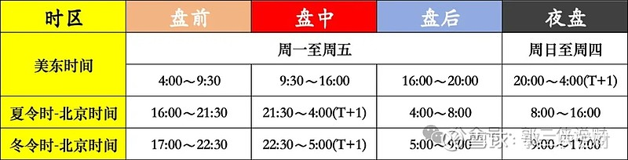

# 银行卡
## 香港
* [香港3大行开户攻略，汇丰、渣打、中银香港](https://xueqiu.com/9412416723/297513177)

| 银行 | 收费 | 电话 | 说明 |
| - | - | - | - |
| [香港汇丰银行](https://www.hsbc.com.cn/)，汇丰ONE | 无存款，无管理费 | 400-820-3090 | [预约开户](https://forms.hsbc.com.hk/zh-hk/forms/make-appointment/)，[网上取票](https://www.eticketing.hsbc.com.hk/Ticket/Index/SC)，香港的本土银行 |
| [香港渣打银行](https://www.sc.com/hk/zh/) | 无存款，账户管理费前6个月免费，6个月后可自由降级到普通个人账户 | 400-888-8083 | [网点](https://www.sc.com/hk/zh/atm-branch-locator/)，[预约开户](https://www.sc.com/hk/zh/gba/china-mobile-account-opening/)，亚非、印度 |
| 香港中银 | 无存款，无管理费 |  | [在香港APP开户，去任意分行网点柜台签名调高额度](https://zhuanlan.zhihu.com/p/690325575)，[预约开户](https://www.bochk.com/sc/contact/online/hkpaccountopen.html) |
| 恒生 |  |  |  |
| 花旗 |  |  |  |
| [香港中信银行](https://www.cncbinternational.com/) |  | 95558 |  |

## 新加坡
| 银行 | 收费 | 电话 | 说明 |
| - | - | - | - |
| 华侨银行(OCBC) |  |  |  |

# 证券
* 费用含佣金和平台费

## 海外
* [港股怎么开户？常见的港股开户方式有哪些？](https://xueqiu.com/2688347802/204415877), [港美股开户指南](https://www.mg21.com/kaihu2024.html)
> 入金注意检查接收方账号的资金类型是否和发送方一致，比如美元打到接收方(港币)账号就会自动美元换汇到港币

### 美国
| 券商 | 费用 | 福利 | 入金方法 | 特点 |
| - | - | - | - | - |
| [盈透](https://www.interactivebrokers.com/) | / | / | 港币：FPS。 美元：汇款。wise帐户转账，在网页端操作 |  |
| [第一证券](https://www.firstrade.com/) | / | / | 同盈透 |  |
| [富达（Fidelity）](https://www.fidelity.com/) | / | / | 同盈透 |  |
| Robinhood | / | / | / | 零佣金的股票、ETF、期权交易。不限制国籍但必须是美国居民 |

### 香港
| 券商 | 费用 | 福利 | 入金方法 | 特点 |
| - | - | - | - | - |
| 长桥香港 | [港股](https://support.longbridgehk.com/topics/1dc1l7t/1ccyl0x), [美股](https://support.longbridgehk.com/topics/1dc1l7t/2yucafb) | 入资1万港币享受港美股终身免佣金，累计入资2万港币（2500美金）有400现金卡 | [入金指引](https://support.longbridgehk.com/topics/4jvueun/41fajdm?locale=zh-CN) | 适合美国 |
| 盈立 | [官方](https://www.usmart.hk/zh-cn/charges) | 只有香港人有免佣 | 同长桥香港 | 套路多，弃用 |
| 尊嘉 | [官方](https://hk-t.zvstglobal.com/qa/three/267) | / | 同长桥香港 | 适合美国和香港 |

### 费用
* 港股：[港股佣金](https://www.zhihu.com/question/382642027)。政府费用是千3，大头是印花税和交收费
* A股：[A股交易手续费](https://zhuanlan.zhihu.com/p/661948622)，大头是印花税
* 美股：政府费用是万2

| 券商 | 港股(佣金) | 港股(平台费) | 港股ETF | 美股(佣金) | 美股(平台费) | 美股ETF |
| - | - | - | - | - | - | - |
| 盈透PRO |  |  |  |  | 0.005/股(1美元-1%) | 0 |
| 第一证券 | 不支持 | 不支持 | 不支持 | 0 | 0 | 0 |
| 长桥香港 | 0 | 15/笔 | 同股票，不收印花税 | 0 | 0.005/股(最低1) | 同股票 |
| 盈立 | 0.03% | 12/笔  | / | 0 | 0.009/股(1.88美元-1%)  | / |
| 尊嘉 | 0 | 1/笔  | 同股票，不收印花税 | 0 | 1，无论股数 | 同股票 |

### 融资和货币基金
> 融资和货币基金的利率基准是货币存款利率

| 券商 | 融资 | 货币基金 |
| - | - | - |
| 长桥 | 利率是5.75% | 申购：09:05前是当天购买成功，赎回：09:05前是当天到账 |
| 尊嘉 | 利率是6.875% | 申购：19点后购买，赎回：10:30前是当天17点后到账 |

### 券商出入金
* 港币：FPS/eDDA。[FPS快捷入金/eDDA/银证转账的区别](https://xueqiu.com/1532246163/158421767): FPS是转账，EDDA是基于FPS的自动扣款。只能是港币，无手续费
* 美金：网银转账。香港内的非同行转账。中银香港到工商银行，收款行收取10港币。中银香港到汇丰银行无费用。
* 除了汇丰One是多币种合一的账号。其他银行账户(如中银香港)有币种区别。转账时注意付款方和收款方必须是同一个币种，否则付款方会自动换汇导致损失钱。

## 股市规则
### 交收
* 交易制度: 投资者购买的股票何时可卖出。T+0是购买当天可卖出
* 交收/结算制度：资金和股票何时交割。T+2是购买后的第2个交易日交割，交割后才可取出资金（周一卖出，周三交割并可取出资金）
* 买入后资金即被冻结。卖出后资金当天可用(交易，如买股票)但不能取出。

| 股市 | 交易制度 | 交收/结算制度 | 最低交易量 |
| - | - | - | - |
| A股 | T+1 | T+1 | 一手，100股 |
| 港股 | T+0 | T+2 | 一手，但不全是100股 |
| 美股 | T+0 | T+1 | 1股，券商支持碎股 |

### 时间
| 股市 | 开盘竞价 | 开市 | 交易 | 收市 | 收盘竞价 |
| - | - | - | - | - | - |
| A股 | 9:15-9:25 | 9:30 | 9:30-11:30和13:00-15:00 | 15:00 | 14:57-15:00 |
| 港股 | 9:00-9:15(可申报和撤单) 9:15-9:20(可申报，不可撤单) 9:20-9:28(不可申报和撤单，开始撮合) 9:28-9:30(不可申报和撤单) | 9:30 | 9:30-12:00和13:00-16:00，12:30-13:00可撤单 | 16:00 | 16:01-16:06(可挂单撤单) 16:06-16:10(可挂单、不可撤单) |

### 税收
* A股：现金分红是个人所得税20%，持有1年后免税
* 美股：外国人免税