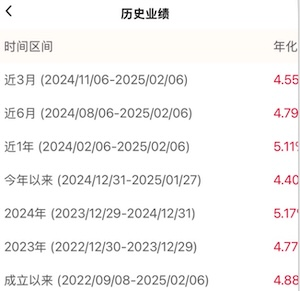

# 国内低风险理财
以下提到的现在是【2025.2.10】

## 适合的资产
### 类型
* 表格按照收益率从低到高排序

| 项 | 产品 | 风险 |
| - | - | - |
| 固收-定期存款 |  | 极低 |
| 固收-债券 | 政府债券、公司债券、地方政府债券等 | 较低 |
| 货币基金 | 短期货币市场工具。如国债、银行定期存单、商业票据等 | 低 |
| 指数基金-宽基 | https://xueqiu.com/3951090421/285607106 | 中 |
| 指数基金-行业 |  | 中高 |

* 固收(固定收益)：在预定的时间内提供固定的利息收益。
* 债券基金(不是债券)要在降息周期买。现在国内利率下降的空间不大，也就是说没多少收益了。24年收益非常好是因为利率降了很多。

### 基金交易
* 渠道
    * 场内(证券开户，同买股票，如华泰证券)
    * 场外(如微众银行、腾讯理财通、支付宝)
* 费用：场内场外都有运营费用
    * 场内：有交易的买卖手续费，有溢价
    * 场外：有申购费和赎回费。长期买A类(一般是一年以上)，短期买C类。

## 资产介绍
### 宽基
* 风险最小的是：沪深300、A500

### 指数基金行业
| 分类 | 名称 | 股票代码 |
| - | - | - |
| 中国-科技 | 恒生科技 | 513010 |
| 中国-科技-中概 | 中概互联 | 159605 |
| 中国-科技 | 科创50 | 588000 |
| 中国-科技-芯片 | 芯片 | 159995 |
| 中国-医疗 | 医疗 | 512170 |
| 世界-科技 | 纳斯达克100 | 159659 |
| 美国-经济 | 标普500 | / |
| 世界-医疗 | 广发全球医疗 | / |

### 外币存款
* 资产是“[美元]中银理财-美元乐享天天益型)-汇(LXTTZYUSDO1A)”。中国银行APP可购买，需考虑汇率风险。

## 本人操作
1. 基金股票等中高风险资产，我只做熟悉的科技和医疗。大头是纳斯达克100。
1. 资产表格里的前三种我现在都未持有。
1. 国内资产我只有基金(中概、沪深300和A500)，太高了我会卖掉。
1. 基金选择方法：包含的股票好 + 基金规模10亿以上 + 交易费用低。指数基金不要买链接类的，需是股票类的。
1. 基金交易：场内成本更低(我的手续费是十万分之5，可以忽略不计)且买卖方便T+1，场外周期一般是T+3。我都是买场内的。国外资产关注溢价率。